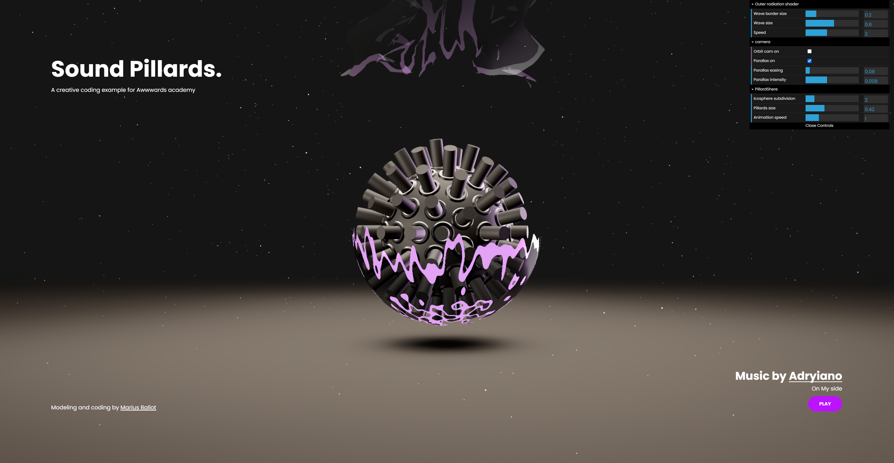

# 👨‍💻✨ The fun process of creating lively interactive 3D scenes for the web ✨👨‍💻
## An Awwwards Academy course by <a target="_blank" href="https://mariusballot.com">Marius Ballot</a>🏂

This Git Repository is the documentation and entrypoint for every assets demos and others of the Awwwards academy course: <strong><a target="_blank" href="https://www.awwwards.com/academy/course/the-fun-process-of-creating-lively-interactive-3d-scenes-for-the-web">The fun process of creating lively interactive 3D scenes for the web</a></strong>.🔮

### A bit about the course

This course is going to show you from start finish my <strong>creative development process</strong> by recreating this interactive online piece: <a href="https://ibc-soundpillards.mariusballot.com/">`IBC Sound Pillards experiment`</a>.

### Course Chapters
*  I - A bit of context
    *  How this course came to be ?
    *  Let's just have some fun creating stuff
*  II - Some fundamentals
    *  [Blender, the basics](#blenderBasics)
    *  [WebGL with Three.js, the basics](#threebasics)
    *  [Shaders, shaders, shaders...](#shadersBasics)
    *  [The fascinating and important process of tool building](#tools)
    *  How I roll about getting more skills
*  III - Before creating
    *  [Visual inspiration](#visInsp)
    *  [Technical inspiration](#technInsp)
    *  [Plan of action](#plan)
*  IV - Let’s create
    *  [Dev environment and workflow overview](#workflow)
    *  [3D modeling and layout](#modeling)
    *  [From Blender to browser](#modelExport)
    *  [Model manipulation](#modelManip)
    *  [Oh yeah, Shaders](#shadersDev)
    *  [Audio Reactors](#audioReact)
    *  [Particles](#particles)
    *  [GUI and customization](#gui)
    *  [Lets add UI](#addUI)
    *  [Details, details, details…](#details)
*  V - Show ya work
    *  Hosting your piece online
    *  If you like it, other people might
    *  Working with designers
*  VII - See ya
    *  What's next ?

_ _ _ _

### Chapters' references

#### Blender the basics

Some amazing Blender YouTube chanels
* <a href="https://www.youtube.com/user/AndrewPPrice" target="_blank">Blender Guru</a>
* <a href="https://www.youtube.com/user/Blenderfan93" target="_blank">CG Geek</a>
* <a href="https://www.youtube.com/user/FlippedNormalsTuts" target="_blank">FlippedNormals</a>
* <a href="https://www.youtube.com/channel/UCuNhGhbemBkdflZ1FGJ0lUQ" target="_blank">Ducky 3D</a>
* <a href="https://www.youtube.com/channel/UCy1f4m64dwCwk8CBZ_vHfPg" target="_blank">CGMatter</a>
* <a href="https://www.youtube.com/channel/UCdpWKLNfbROyoGPV46-zaUQ" target="_blank">Default Cube</a>

>##### Post editing notes
> * 10m14s -> Blender's Evee renderer actually IS a real time renderer
> * 10m18s -> Blender's Cycles renderer uses rayscasting for its rendering process giving this "close to reality" lighting conditions. More on raycasting <a href="https://en.wikipedia.org/wiki/Ray_casting">right here</a>

#### WebGL with Three.js, the basics 

Source files
* <a href="./demos/SimpleThreeJSBoilerPlate" target="_blank">Three.js Bearbones Boiler plate</a>
* <a href="./demos/ThreeJSModelImportExample" target="_blank">Three.js GLTF imported model example</a>

Having a ginormous comunity, you really have 1000 ways to learn Three.js. Here are some of my favorite places to learn more about this wonderfull library
* [Three.js fundamentals](https://threejsfundamentals.org/threejs/lessons/threejs-fundamentals.html)
* [This old but still relevant youtube series](https://www.youtube.com/watch?v=YKzyhcyAijo)
* [Three.js examples library](https://threejs.org/examples/)

Three.js also has one of the best documentation of any other js library. You can find it [here](https://threejs.org/docs/)

#### Shader, shaders, shaders... 

Shaders documentations and resources
* [The Book of Shaders](https://thebookofshaders.com/)
* [Pixel Spirit Deck](https://patriciogonzalezvivo.github.io/PixelSpiritDeck/)
* [Shadertoys](https://www.shadertoy.com/)
* [Shader-tutorial.dev](https://shader-tutorial.dev/)

Source files
* <a href="./demos/SimpleThreeJShader" target="_blank">Simple Three.js custom shader setup</a>

#### The fascinating and important process of tool building 

The tools examples referenced in this section
* [RAF - A global request animation frame handler](https://github.com/MariusBallot/04-2021-Vue-Three-Starter/blob/main/src/utils/RAF.js)
* [📹 Three CamParallax 🚤](https://github.com/MariusBallot/04-2021-CamParallax)
* [✨Three.BufferGeometry particle system✨](https://github.com/MariusBallot/Three-Particle-System)
* [✨ Vue Three Starter ✨](https://github.com/MariusBallot/04-2021-Vue-Three-Starter)

#### Visual inspiration 
Visual inspiration websites

* [Pinterest](https://www.pinterest.com/)
* [Awwwards](https://www.awwwards.com/)
* [Dribbble](https://dribbble.com/)

Some great Instagram visual inspiration accounts
* [creativecodeart](https://www.instagram.com/creativecodeart/)
* [shedrawswithcode](https://www.instagram.com/shedrawswithcode/)
* [Joshua Davis](https://www.instagram.com/praystation/)
* [boldtron](https://www.instagram.com/boldtron/)

#### Technical inspiration 
Tech inspiration websites
* [Codrops](https://tympanus.net/codrops/)
* [Medium programming](https://medium.com/topic/programming)

Some great tech inspiration Twitter accounts and Youtube chanels
* [Three.js Twitter](https://twitter.com/threejs)
* [Pavel Boytchev](https://twitter.com/PavelBoytchev)
* [Dennys Kuhnert](https://twitter.com/DennysKuhnert)
* [Bruno Simon](https://twitter.com/bruno_simon)
* [Fireship](https://www.youtube.com/channel/UCsBjURrPoezykLs9EqgamOA)
* [Sebastian Lague](https://www.youtube.com/user/Cercopithecan)

#### Plan of action 

My favorite project management tools
* [Trello](https://trello.com/)
* [Notion](https://www.notion.so/)

#### Dev environment and workflow overview <a name="workflow">
Source files
* <a href="https://github.com/MariusBallot/04-2021-Vue-Three-Starter" target="_blank">Vue Three.js starter</a>

#### 3D modeling and layout 
Source files
* <a href="./demos/IBC-SoundPillards/P2-3DModelingAndLayout" target="_blank">P2 - 3D Modeling And Layout Sources</a>

#### From Blender to browser
Source files
* <a href="./demos/IBC-SoundPillards/P3-FromBlenderToBrowser" target="_blank">P3 - From Blender to browser</a>

#### Model manipulation
Source files
* <a href="./demos/IBC-SoundPillards/P4-ModelManipulation" target="_blank">P4 - Model manipulation</a>

#### Oh yeah, Shaders
Source files
* <a href="./demos/IBC-SoundPillards/P5-Shaders" target="_blank">P5 - Oh yeah, Shaders</a>

>##### Post editing notes
> * 17m17s -> Single letter variable names are a bad habit of mine that would be better to avoid 😳
> * 29m48s -> Using an `if(x<y)x=y` was kind of lazy but easy to understand. A more GLSL friendly approach would be using a `clamp()` method. More on that [here](https://www.khronos.org/registry/OpenGL-Refpages/gl4/html/clamp.xhtml)

#### Audio Reactors
Source files
* <a href="./demos/IBC-SoundPillards/P6-AudioReactors" target="_blank">P6 - Audio Reactors</a>

#### Particles
Source files
* <a href="./demos/IBC-SoundPillards/P7-Particles" target="_blank">P7 - Particles</a>

#### GUI and customization
Source files
* <a href="./demos/IBC-SoundPillards/P8-GUIAndCustomization" target="_blank">P8 - GUI and customization</a>

#### Lets add UI
Source files
* <a href="./demos/IBC-SoundPillards/P9-LetsAddUI" target="_blank">P9 - Lets add UI</a>

#### Details, details, details…
Source files
* <a href="./demos/IBC-SoundPillards/P10-Details" target="_blank">P10 - Details, details, details…</a>

_ _ _ _

## A huge thank you
### Those who helped behind the scenes

* [Niccolo Miranda](https://twitter.com/niccolomiranda)
* [Michael De Laborde](https://twitter.com/michael_dlb)
* [Adrien Calmesnil](https://twitter.com/Aquilenn)
* [Sarah Manzaro](https://www.linkedin.com/in/sarah-manzaro/?originalSubdomain=fr)
* [Lola Millot](https://www.linkedin.com/in/lola-millot-723b00208/)
* [Charles Arnould](https://www.linkedin.com/in/charles-arnould-3a3161185/)
* [Elena Moreac](https://www.linkedin.com/in/el%C3%A9na-mor%C3%A9ac-b764961b9/)
* [Maximilien Dufau](https://www.linkedin.com/in/maximilien-dufau/)
* [Karl Justiniano](https://www.linkedin.com/in/karljstn/)